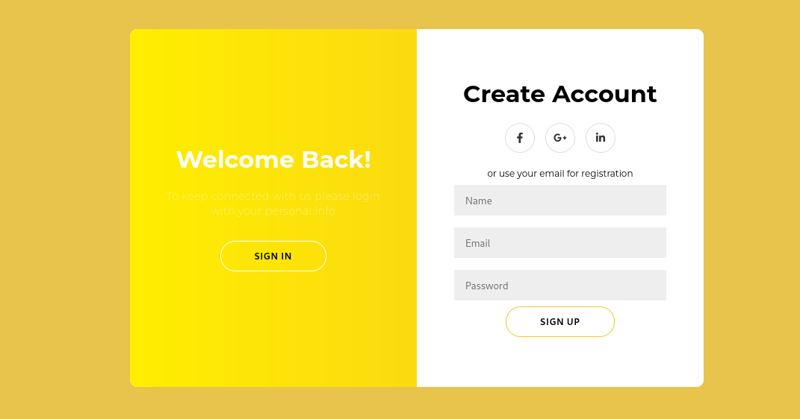
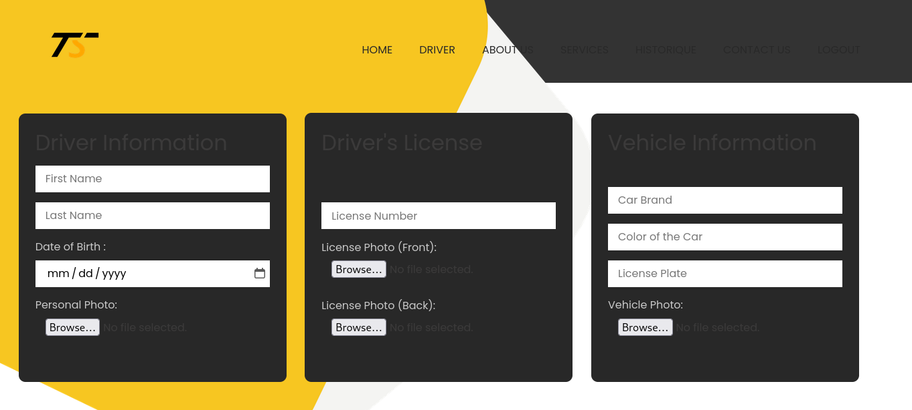
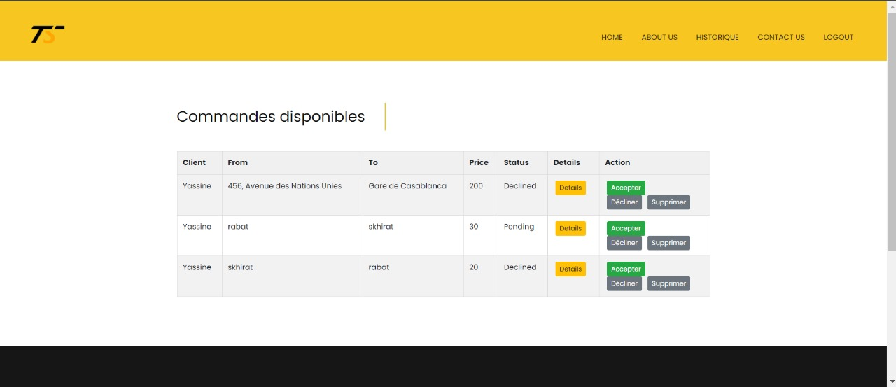

# 🚖 T SIR – Application Web de Réservation de Taxi en Ligne

## 🧾 Description du projet

**T SIR** est une application web destinée à améliorer la réservation de taxis, en réduisant les temps d’attente et en offrant une meilleure transparence sur les tarifs. L’application met en relation directe les clients et les conducteurs, avec un système de suivi en temps réel, d’inscription, de géolocalisation et de gestion des courses.

Elle a été développée avec **Python**, **Django**, **HTML/CSS/JS** et **SQLite**, selon une approche **agile**.

---

## 🛠️ Outils et Technologies Utilisées

| Outil / Technologie | Rôle |
|---------------------|------|
| **Python**          | Langage principal |
| **Django**          | Framework backend |
| **SQLite**          | Base de données légère |
| **HTML / CSS / JS** | Développement frontend |
| **StarUML**         | Modélisation UML |
| **API REST**        | Intégration des fonctionnalités |
| **Scrum**           | Méthodologie de gestion de projet |

---

## 🖼️ Captures d'écran

### 🔐 Authentification

<div align="center">
  
  
</div>

### 🧑‍💼 Interfaces Client & Conducteur

<div align="center">
  
  
</div>

### 📍 Gestion de course & erreurs

<div align="center">
  
  
</div>


---

## 🚀 Comment lancer le projet

### 1. Cloner le dépôt

```bash
git clone https://github.com/ton-utilisateur/t-sir.git
cd t-sir
```
### ✨ Made with 💻 by JOSKA
